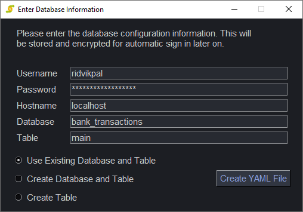

# SimplyTrack

A simple financial tracker used to manage bank transactions stored in a MySQL server. I use this personally to securely combine the transactions I have across all my bank accounts. Then, using the graph features, I can track spending and income trends across multiple accounts. For example: (these are just sample bank transactions, obviously!)


## Initial Setup
The program requres three files in order to work properly:
1. YAML Server Configuration File: Information on the database to connect to
2. key.bin: AES encryption key to decrypt the password when signing in
3. password.bin: AES 256 Bit Encrypted password that must be decrypted before signing in

All of these files are automatically generated by the setup wizard upon either signing in for the first time, or if either of these files gets corrupted. The user simply has to enter their database information to the wizard and it will automatically generate their information:



As you can see, alongside the MySQL server information you have the opportunity to create new databases and tables in order to automatically setup the right table configuration to start entering data immediately. Of course, you need to have the right creation privliges for the MySQL server you are accessing. In case you want to generate the table yourself, here are the parameters for a table that this application is compatible with:

```
+------------------+------------+------+-----+---------+----------------+
| Field            | Type       | Null | Key | Default | Extra          |
+------------------+------------+------+-----+---------+----------------+
| id               | mediumint  | NO   | PRI | NULL    | auto_increment |
| account_type     | mediumtext | YES  |     | NULL    |                |
| account_number   | bigint     | YES  |     | NULL    |                |
| transaction_date | date       | YES  |     | NULL    |                |
| amount           | double     | YES  |     | NULL    |                |
| description      | longtext   | YES  |     | NULL    |                |
+------------------+------------+------+-----+---------+----------------+
6 rows in set (0.0023 sec)
```

## Features
SimplyTrack is a simple financial tracker, but it has lots of features.

### Light/Dark Mode

## Features to Implement in the Future