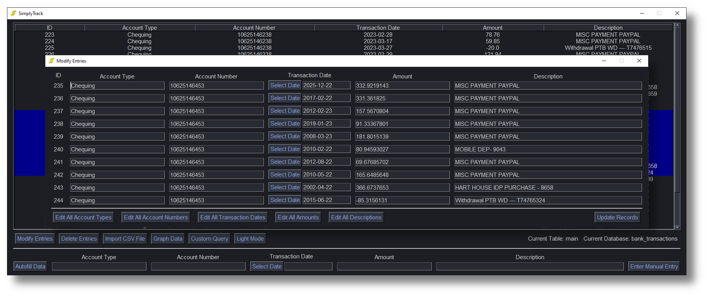
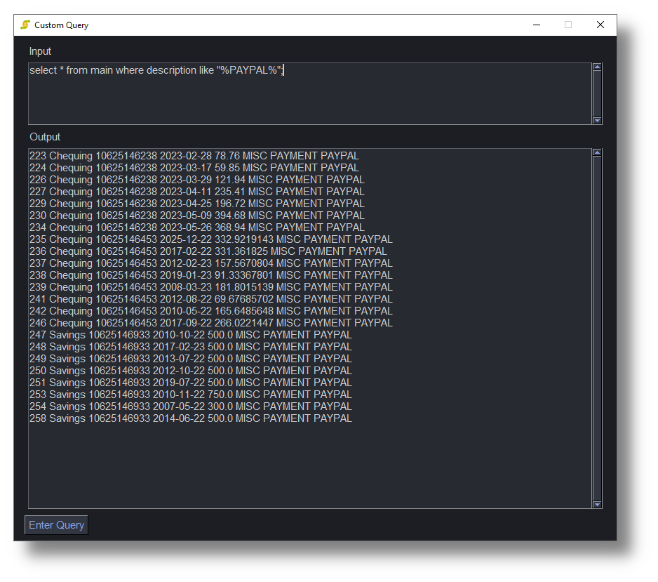

# SimplyTrack

The logo contains an icon from www.flaticon.com:

<a href="https://www.flaticon.com/free-icons/transaction" title="transaction icons">Transaction icons created by Aficons studio - Flaticon</a>

## Introduction
A simple financial tracker used to manage bank transactions stored in a MySQL server. I use this personally to securely combine the transactions I have across all my bank accounts and track them. Then, using the graph features, I can track spending and income trends across multiple accounts. For example: (these are sample bank transactions, not my personal ones, obviously!)

## Goals
Before creating SimplyTrack, I used to track all my bank transactions with an excel spreadsheet. The cons with that method were that I would have to store that excel sheet in the cloud, in case something ever happened to that local machine. I find this to be a more secure "remote" alternative (it is stored in an encrypted SQL server with it's own encrypted key and password). I have a dedicated home server machine that I can use for the SQL server with a static IP address and use that as a "cloud" to store all of my transactions that I am tracking. Because storage is cheap nowadays, it offers me more peace of mind than storing my data in OneDrive for example. Additionally, I wanted to learn and improve my skills with Python, MySQL and `matplotlib`, which are used in developing this application.

## External Libraries
This python application was originally created using python 3.11.3. The following external python libraries are used in this project:

| Library           | Used For                                                                                     |
| ----------------- | -------------------------------------------------------------------------------------------- |
| `csv`             | Importing data from a compatible csv file.                                                   |
| `matplotlib`      | Graphing the bank transaction data to visualize the trends.                                  |
| `itertools`       | Accumulate the amounts in all bank transactions for the graph.                               |
| `PySimpleGUI`     | Create the entire user interface.                                                            |
| `mysql.connector` | Connect, query, and modify the MySQL Database.                                               |
| `yaml`            | Manage the yaml configuration file.                                                          |
| `pathlib`         | Standardize file paths for different operating systems.                                      |
| `datetime`        | Create and manage dates and times                                                            |
| `Crypto`          | 256-bit AES symmetric encryption and decryption of MySQL database.                           |
| `random`          | Generate a random string to use for salt during encryption.                                  |
| `string`          | Get standard characters used in strings for random salt creation during encryption.          |
| `Decimal`         | Provide greater precision than `float` for bank transaction amounts when importing from csv. |

## Code Files
The program source code has been broken down into 5 files:

| File                  | Contains Code For                                                                                |
| --------------------- | ------------------------------------------------------------------------------------------------ |
| `gui.py`              | For the user interface. Main file to run, starts the program.                                    |
| `graph.py`            | Graphing the accumulated amounts in all bank accounts.                                           |
| `encrypt.py`          | Encrypting and Decrypting the password for MySQL with AES 256-bit encryption.                    |
| `extract_csv.py`      | Extracting the bank transaction data from a CSV file with dynamic row selection.                 |
| `mysql_management.py` | Managing bank transaction records, and setting up YAML configuraiton file in the MySQL database. |

## Initial Setup
The program requires three files in order to work properly:
1. `server_configuration.yaml`: Information on the database to connect to.
2. `key.bin`: AES encryption key to decrypt the password when signing in.
3. `password.bin`: AES 256 Bit Encrypted password that must be decrypted before signing in.

All of these files are automatically generated by the setup wizard upon either signing in for the first time, or if either of these files gets corrupted. The user simply has to enter their database information to the wizard and it will automatically generate their information:

  

As you can see, alongside the MySQL server information you have the opportunity to create new databases and tables in order to automatically setup the right table configuration to start entering data immediately. Of course, you need to have the right creation privileges for the MySQL server you are accessing. In case you want to generate the table yourself, here are the parameters for a table that this application is compatible with:

| Field              | Type       | Null | Key  | Default | Extra          |
| ----------------   | ---------- | ---- | ---- | ------- | -------------- |
| `id`               | mediumint  | NO   | PRI  | NULL    | auto_increment |
| `account_type`     | mediumtext | YES  |      | NULL    |                |
| `account_number`   | bigint     | YES  |      | NULL    |                |
| `transaction_date` | date       | YES  |      | NULL    |                |
| `amount`           | double     | YES  |      | NULL    |                |
| `description`      | longtext   | YES  |      | NULL    |                |

## Features
SimplyTrack is a simple financial tracker, but it has quite a few features. All of these features were ones that I would want in a financial tracker to replace my Excel file.

### AES Password Encryption
As mentioned in the setup section, the password you supply for your MySQL server is always encrypted in with 256 Bit AES Encryption using the `pycryptodome` library. The key is randomly generated using a random string (that includes characters, digits, and special characters) and a 128 bit salt.

### Basic Usage
Upon logging into the MySQL database, you will be greeted with the bank transactions you have entered into the database. Of course, you can do things like:
* Create New Entries
* Select Entries
* Modify Old Entries
* Delete Entries
* Bulk Edit Entries

### CSV Data Import
SimplyTrack has the ability to import data from CSV files. For this feature, I could have used the pandas csv reader, and I will change this in the future to use the pandas one, but I wanted the csv reader to be "smart". At the time of development, I wanted the csv reader to auto determine which rows contained which data by checking the headers. If the same data was split between multiple columns, it should be able to take that data and concatenate it. I didn't investigate how to do it with pandas at the time, but now I see it is possible and in the future I will change it. However, it is still fully functional and the CSV Import will import all the required data if it finds it in the CSV file:

### Graph All Data

This is the feature I find the most useful. One of the most common things I do in my Excel financial tracker is track my account balance based on the transactions I do. This feature has been implemented with matplotlib. Additionally, I added a smart annotation that allows you to click on data points and see how a transaction either increased or decreased your balance. Very useful for checking your spending and earning habits and trends across *all accounts*:

### Custom Query Mode

SQL Queries have so much potential, and it is impossible to implement all of them into a GUI format. Therefore, for advanced users, I have added a custom query mode, so you can input direct SQL queries and get an output. It is basically another SQL input terminal:

### Light/Dark Mode
Of course, with modern UI applications having both light mode and dark mode, SimplyTrack just had to have it! By default it starts off with dark mode, but you can click the light mode button to theme the entire UI in light mode if you like:

## Features to Implement in the Future
* Sorting Features on the Table (sort by different column value, like in Excel tables).
* Date filters to filter transactions across different dates.
* Multithreading with threading library to yield some performance gains (performance is already decent, but could be better).
* Shift from PySimpleGUI to PyQt5 (or PyQt6) as that library has native support for SQL table models.
* Use pandas for csv import.
